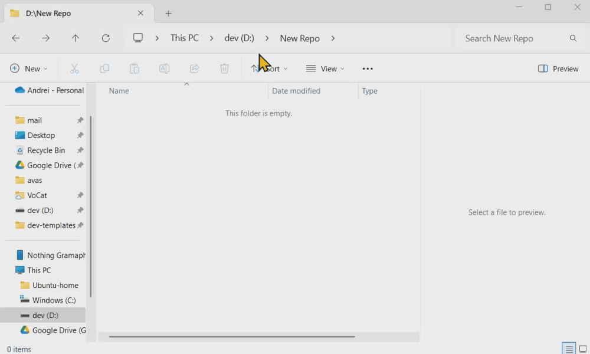

# creator


**Creator** is a TUI application designed to simplify starting new projects using user-defined templates.

⚠️ WARNING: This project is a work in progress and may contain unhandled exceptions or bugs. Only the "happy path" is guaranteed to work 😅.

Contributions are welcome! Feel free to submit feature requests or bug reports.



For the application design and architecture see [docs/design.md](docs/design.md).

## Table of Contents

- [creator](#creator)
    - [Table of Contents](#table-of-contents)
    - [🚀 Installation](#-installation)
    - [🌱 Environment variables](#-environment-variables)
    - [📂 Template Structure](#-template-structure)
        - [Storage Layout](#storage-layout)
        - [Template Variables](#template-variables)
    - [💡 Notes](#-notes)

## 🚀 Installation

1. Copy the application to your desired location.
2. Set up templates:
    - Place your templates in `~/.creator-templates`, or
    - Define a custom location using the `CREATOR_STORAGE` environment variable.
3. Add Creator to PATH:
    - Ensure the application directory is included in your system's PATH.
4. Run Creator:
    - Navigate to the directory where you want to create a new project and run: creator.
5. Exit the application:
    - Use `q` or `Ctrl+C` to close.


## 🌱 Environment variables

- `CREATOR_STORAGE`: Specifies the path to your templates directory.

## 📂 Template Structure

### Storage Layout

```plaintext
Storage/
    |- group_a/
    |  |- template_directory_a/
    |  |  |- [files and dirs]
    |  |- template_directory_b/
    |  |  |- [files and dirs]
    |  |  |- ...
    |  ...
    |
    |- group_b/
    |  |- template_directory_a/
    |  |  |- [files and dirs]
    |  ...
    |
    ...
    
```

Note: dotfiles and directories are ignored by the application.

### Template Variables

You can define variables within template files and filenames using the following syntax:

- `#var_NAME_OF_VAR#` - This placeholder will be replaced with user-defined values during project creation.

For the example see: [tests/test_storage](tests/test_storage)

## 💡 Notes

- **Template Groups**: Organize your templates into logical groups for easy navigation.
- **Customizable Variables**: Enhance templates by leveraging variable placeholders for dynamic project creation.

For questions, feedback, or contributions, don't hesitate to reach out!
