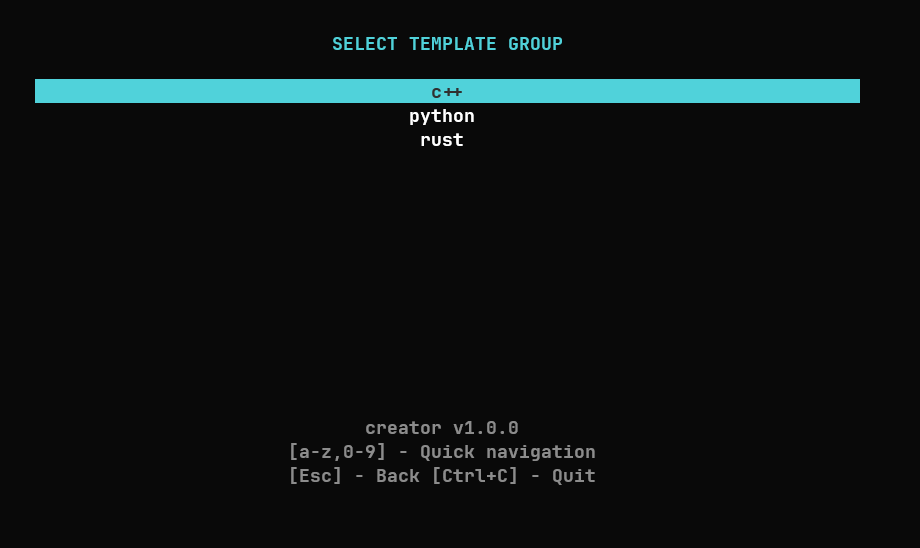
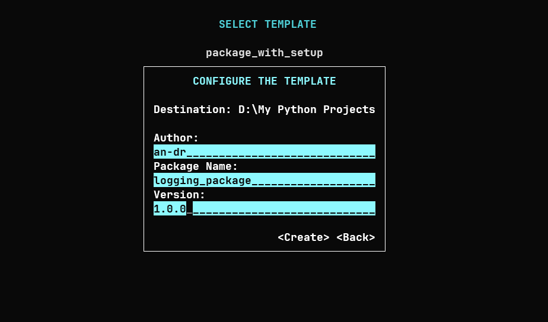
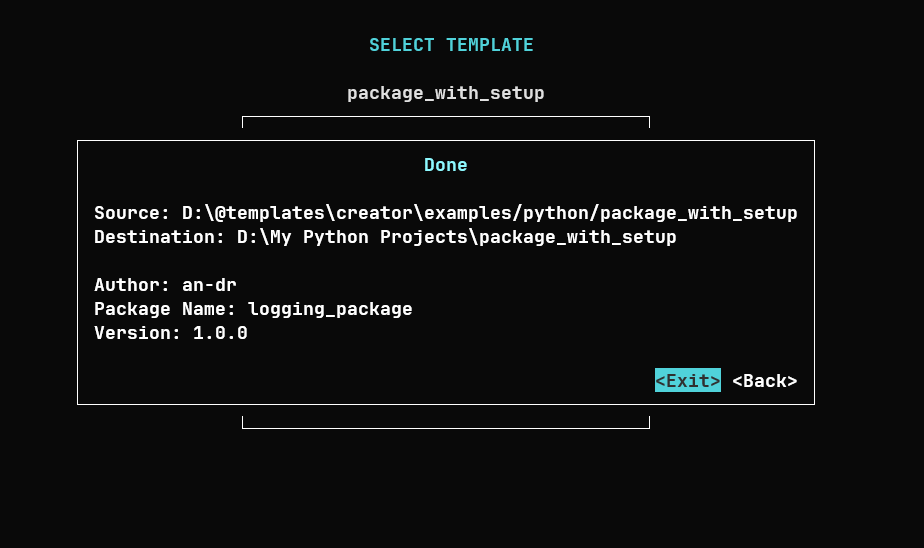

# **creator** - start a new project not from scratch


<!-- table for screenshots -->

[](https://github.com/an-dr/creator/releases)



**Creator** is a TUI application designed to simplify starting new projects using user-defined templates.

|  |  |
|---|---|


[Contributions](#-contribute) are welcome! Feel free to submit feature requests or bug reports.


## Table of Contents

- [**creator** - start a new project not from scratch](#creator---start-a-new-project-not-from-scratch)
    - [Table of Contents](#table-of-contents)
    - [📺 Demo](#-demo)
    - [🚀 Installation](#-installation)
    - [🌱 Environment variables](#-environment-variables)
    - [📂 Template Structure](#-template-structure)
        - [Storage Layout](#storage-layout)
        - [Template Variables](#template-variables)
    - [💡 Notes](#-notes)
    - [🤝 Contribute](#-contribute)
    - [License](#license)

## 📺 Demo


## 🚀 Installation

1. Copy the application to your desired location.
2. Set up templates:
    - Place your templates in `~/.creator-templates`, or
    - Define a custom location using the `CREATOR_TEMPLATES` environment variable.
    - You may want to copy templates from the [examples](examples) directory as a starting point.
3. Add Creator to PATH:
    - Ensure the application directory is included in your system's PATH.
4. Run Creator:
    - Navigate to the directory where you want to create a new project and run: creator.
5. Enjoy! 🎉

## 🌱 Environment variables

- `CREATOR_TEMPLATES`: Specifies the path to your templates directory.

## 📂 Template Structure

### Storage Layout

```plaintext
Storage/
    |- group_a/
    |  |- template_directory_a/
    |  |  |- [files and dirs]
    |  |- template_directory_b/
    |  |  |- [files and dirs]
    |  |  |- ...
    |  ...
    |
    |- group_b/
    |  |- template_directory_a/
    |  |  |- [files and dirs]
    |  ...
    |
    ...
    
```

Note: dotfiles and directories are ignored by the application.

### Template Variables

You can define variables within template files and filenames using the following syntax:

- `@{Name of a Variable}@` - This placeholder will be replaced with user-defined values during project creation. And will be prompted like this:

```plaintext
Name of a Variable: ________
```

Yes, you can use spaces in the variable name! 😄


## 💡 Notes

- **Template Groups**: Organize your templates into logical groups for easy navigation.
- **Customizable Variables**: Enhance templates by leveraging variable placeholders for dynamic project creation.

For questions, feedback, or contributions, don't hesitate to reach out!

## 🤝 Contribute

For the application design and architecture see [docs/design.md](docs/design.md).

## License

This project is licensed under the MIT License - see the [LICENSE](LICENSE) file for details.
